# KenexAI Architecture and Workflow Diagrams

Short explanations accompany each diagram. Labels describe current implementation unless marked **PLANNED / FUTURE**.

## 1. System Architecture Diagram

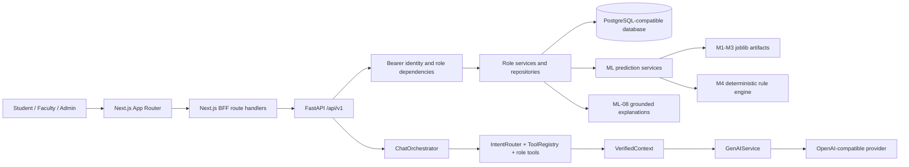

The frontend reaches role services through BFF routes; ML and GenAI remain backend boundaries.

## 2. High-Level Data Flow Diagram

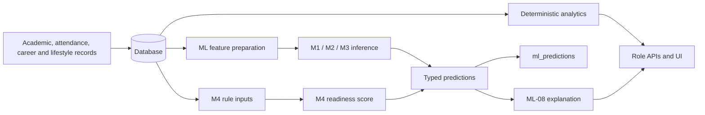

## 3. Student Module Workflow

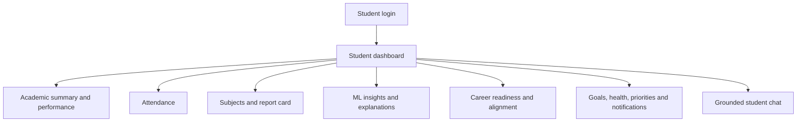

The student paths use the authenticated student identity and own-data scope.

## 4. Faculty Module Workflow

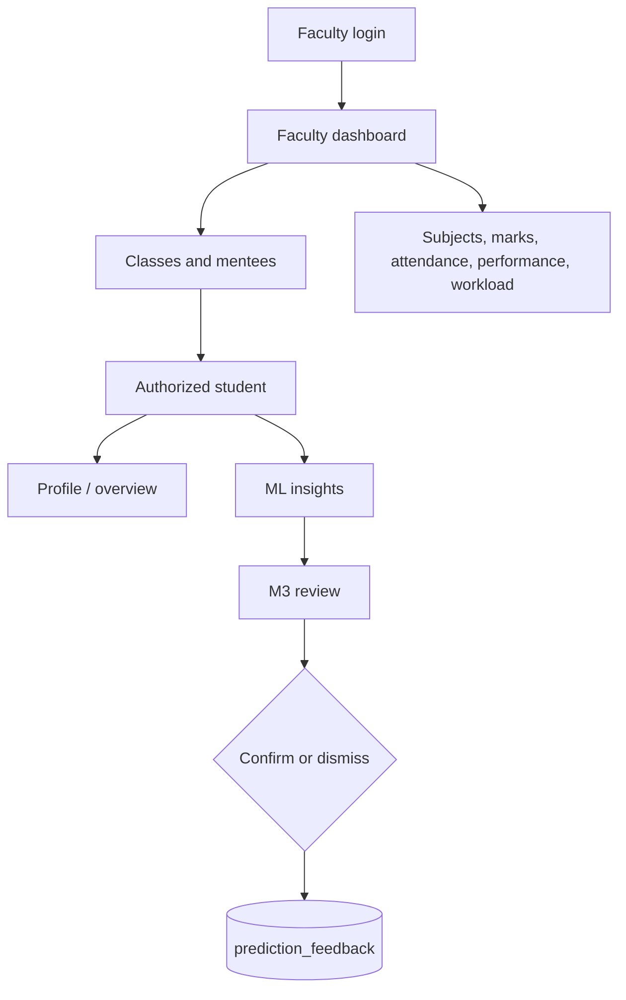

Faculty scope is checked before student-specific data, prediction, or feedback operations.

## 5. Admin Module Workflow

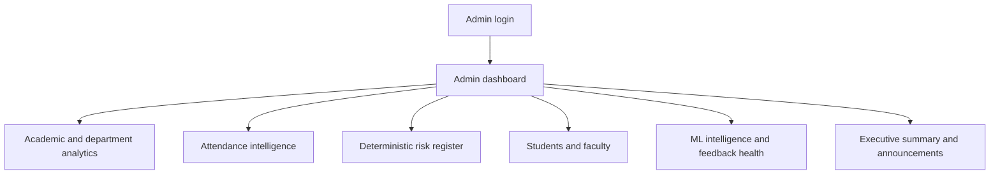

## 6. Authentication and RBAC Flow

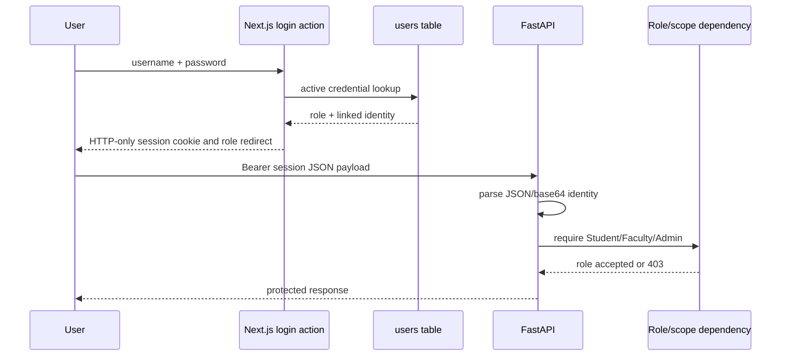

The current integration uses a plaintext JSON session payload; JWT is **PLANNED / FUTURE**.

## 7. Database ER Diagram

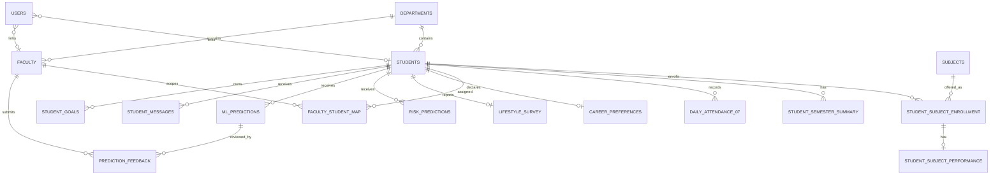

The diagram shows runtime relationships evidenced by SQL/service usage; complete foundational DDL/RLS state is **NOT VERIFIED**.

## 8. ETL and Data Pipeline

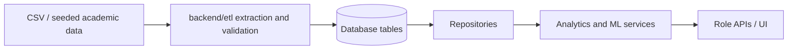

The repository contains ETL code and generated datasets. A deployed warehouse orchestration is **NOT VERIFIED**.

## 9. ML Pipeline

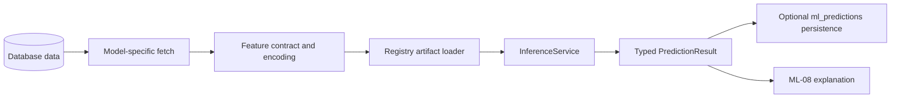

## 10. M1-M4 Architecture

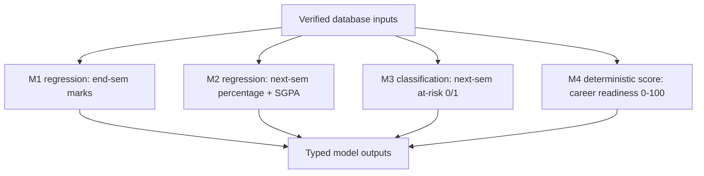

M1-M3 use joblib artifacts. M4 is explicitly rule-based and has no required trained artifact.

## 11. ML Prediction Lifecycle

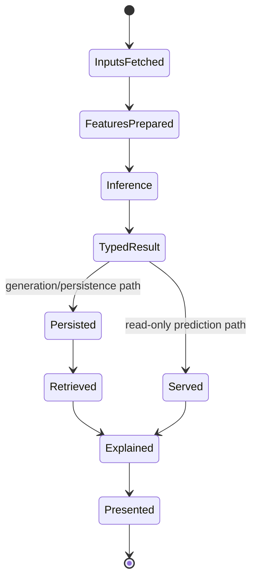

## 12. ML-08 Explainability Flow

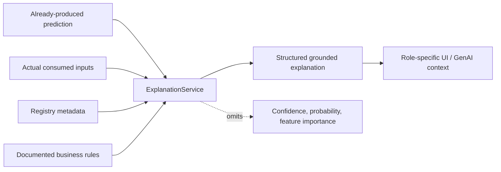

## 13. ML-12 Feedback Loop

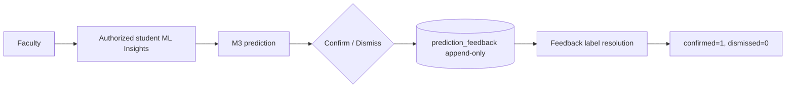

## 14. ML-13 Retraining Loop

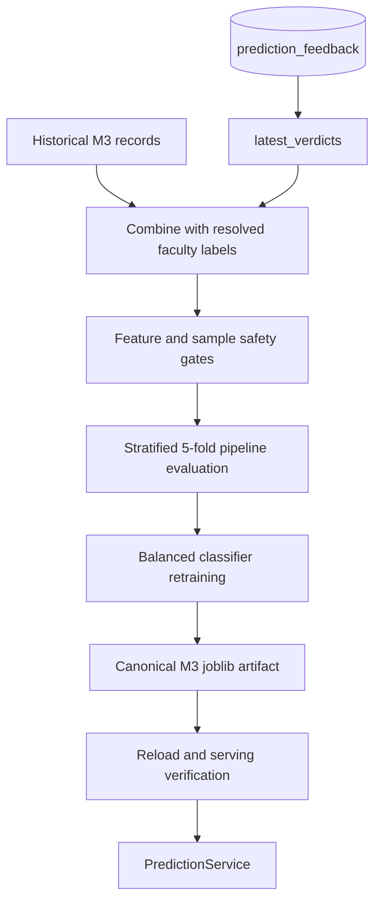

## 15. GenAI Architecture

```mermaid
flowchart LR
  CHAT[Chat API] --> ORCH[ChatOrchestrator]
  ORCH --> ROUTER[IntentRouter]
  ROUTER --> REG[ToolRegistry]
  REG --> TOOL[Role-specific implemented tool]
  TOOL --> CONTEXT[VerifiedContext]
  CONTEXT --> SERVICE[GenAIService]
  SERVICE --> ADAPTER[OpenAICompatibleProvider]
  ADAPTER --> LLM[Configured external model]
  LLM --> RESPONSE[Normalized ChatResponse]
```

## 16. GenAI Grounding Flow

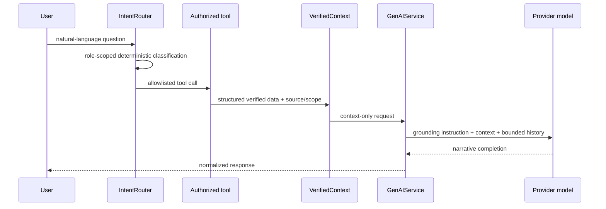

The LLM does not receive arbitrary SQL, a database pool, or model artifacts.

## 17. GenAI Student Flow

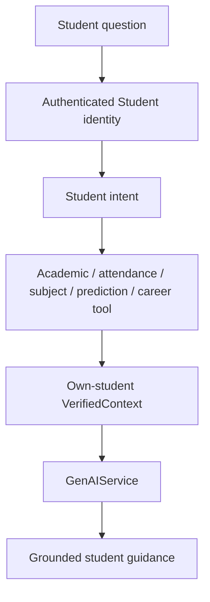

## 18. GenAI Faculty Flow

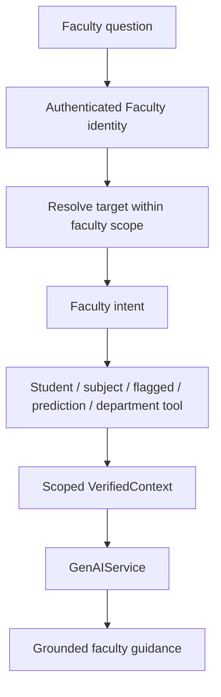

## 19. GenAI Admin Flow

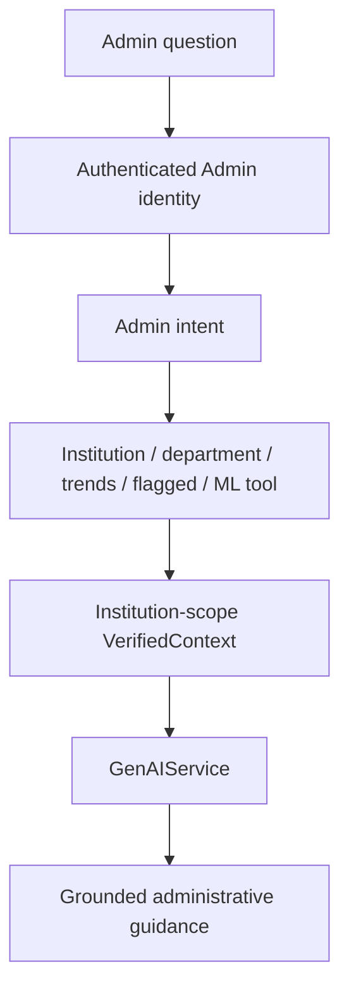

## 20. Complete End-to-End KenexAI Workflow

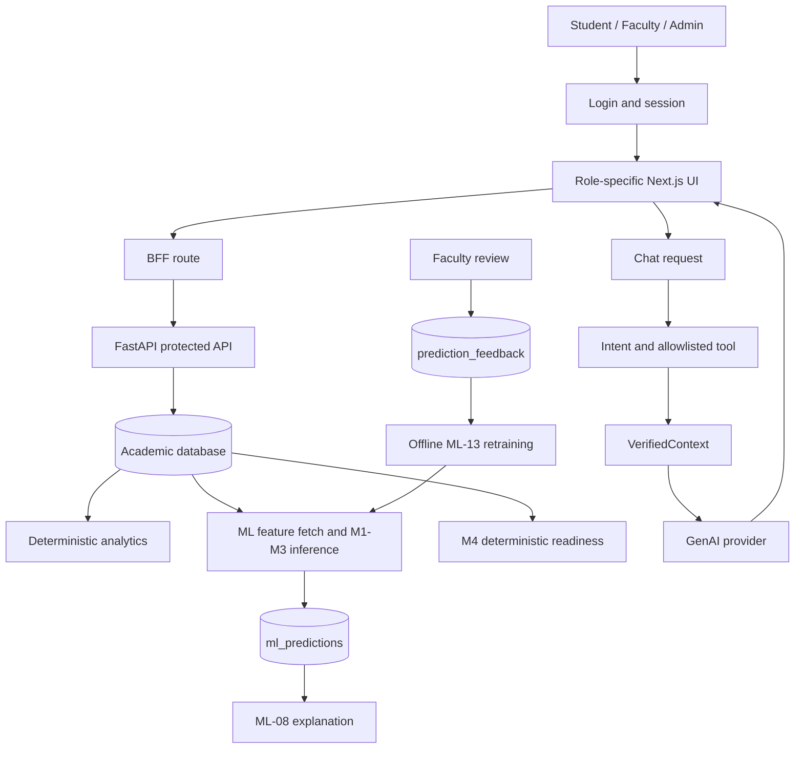

This is the complete current flow; automated deployment, MLflow promotion and scheduled retraining would be **PLANNED / FUTURE**.
